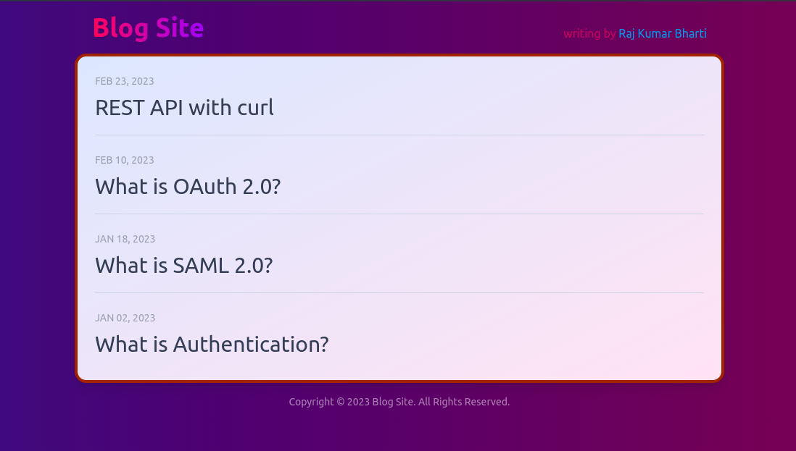

# Blog Site

> Render content from markdown files



Example with Next.js **Page Router**

## Tech Stack

- [Next.js](https://nextjs.org/)
- [Tailwind CSS](https://tailwindcss.com/)

## Prerequisites

- Install [Node](https://nodejs.org/en/download/)

## Running Application

```shell
pnpm install
pnpm dev
```
